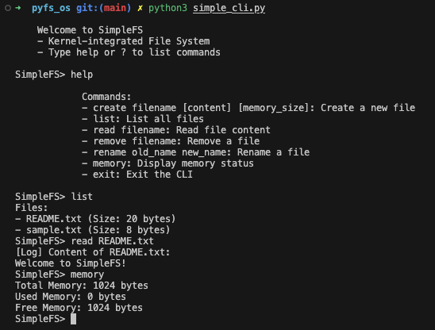
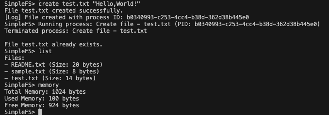
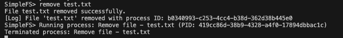
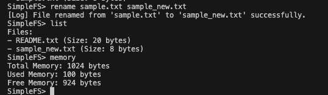

# Simple OS simulator for csye 6230 course project

## Introduction
This project is a simple OS simulator for csye 6230 course project. It is a simple OS simulator that simulates the behavior of an operating system and file system. The simulator is written in Python and is designed to be easy to understand and modify.

## Project Structure
The project is organized into the following directories:
- `simple_kernel.py`: Contains the implementation of the simple OS simulator. It consists of a simple kernel with Class of `MemoryManager`, `InterruptController`, `Process`, `ProcessScheduler`, and `Kernel`.
- `simple_fs.py`: Contains the implementation of the simple file system simulator. It consists of a simple file system with Class of `FileSystemProcess`, `FileSystem` that interacts with the `MemoryManager` and `ProcessScheduler`in the kernel.
- `simple_cli.py`: Contains the implementation of the simple command line interface for the OS simulator. It consists of a simple CLI that allows users to interact with the OS and file system using commands from terminal.
- `filesystem.json`: Contains the initial state of the file system. It is a JSON file that contains the initial state of the file system, including the files and their contents.
- `README.md`: Contains the project documentation.


## Usage
To run the OS simulator, simply run the `simple_cli.py` script.
```
python3 simple_cli.py
```

The simulator will start and display a command prompt. You can then enter commands to interact with the OS and file system. The following commands are supported:
- create filename [content] [memory_size]: Create a new file
- list: List all files
- read filename: Read file content
- remove filename: Remove a file
- rename old_name new_name: Rename a file
- memory: Display memory status
- exit: Exit the CLI

## Example
Here is an example of using the OS simulator:
### help, list, read, memory

### create

### remove

### rename


## Total line of codes
Approximately 600 lines of code.
